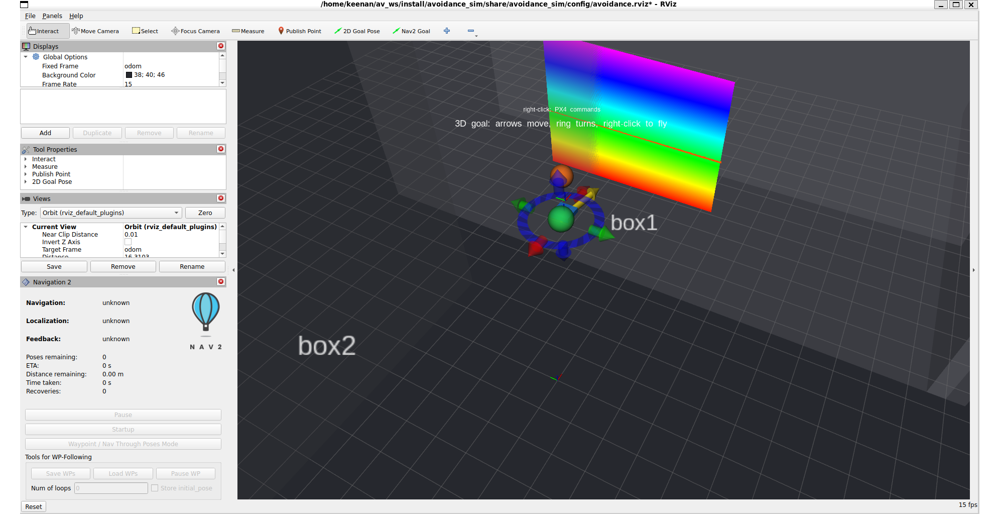
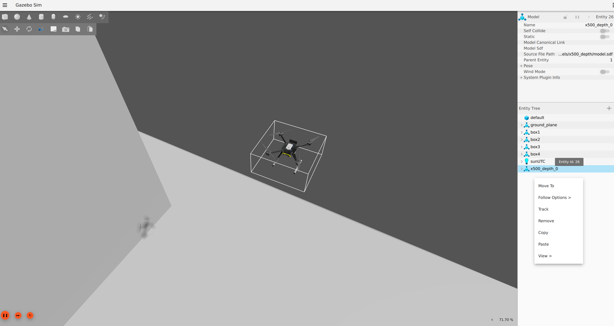
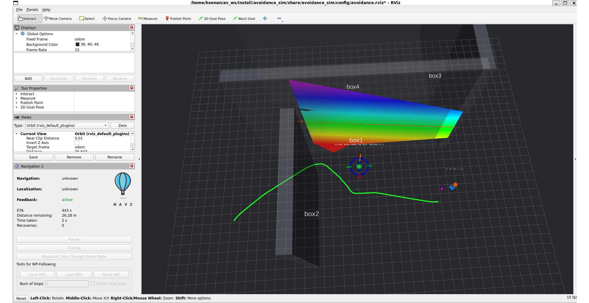

# Fly it

Everything is driven from RViz. Two balls, two menus, two modes.

## What you are looking at

RViz opens with the bundled layout. From the bottom up: a grid, the TF tree,
the depth camera's point cloud, a blue box for the aircraft, and the walls of
the Gazebo world drawn as outlines. Then the two controls: a green ball with
three arrows and a ring, and an orange ball above the aircraft. With the Nav2 launch there are also
the planned path (green ribbon), the 2D scan Nav2 sees (orange points), pure
pursuit's lookahead point (magenta) and its collision-check arc (red), and a
Navigation 2 panel docked beside Displays.



The same moment in Gazebo. Terminal 1 ran with `HEADLESS=1`, so this window
was attached afterwards with `gz sim -g` in another terminal, which connects
a GUI to the running server without a restart.



One display ships switched off: the local costmap. On the development
machine, enabling it crashed RViz through an OGRE shader fault in the Map
display. Tick it on in Displays if your driver copes; the scan and plan
displays tell the same story without it.

## Brake mode: fly on sticks, PX4 brakes

This is the mode the stack starts in. The pilot streams synthetic manual
control, PX4 stays in Position mode, and PX4's collision prevention vetoes
motion toward anything the camera sees within `CP_DIST`.

The green ball is the goal:

| Do | Effect |
|---|---|
| Drag an arrow | Move the goal east, north or up |
| Drag the ring | Set the heading it will hold. The yellow arrow shows it |
| Right-click, `FLY HERE (avoidance ON)` | Fly there with collision prevention live |
| Right-click, `FLY HERE (direct, NO avoidance)` | PX4's own reposition. Turns off the thing this repository is about |
| Right-click, `STOP` | Release the pilot |
| Right-click, `snap to aircraft` | Bring the ball to the aircraft |

The orange ball is the aircraft: `ARM`, `TAKEOFF`, `LAND`, `DISARM`,
`DISARM (FORCE, in air)`, and the two mode entries below.

The first flight, in order:

1. Wait for `Ready for takeoff!` in the PX4 terminal. For tens of seconds
   after boot PX4 reports `ekf2 missing data` and refuses to arm.
2. Right-click the orange ball, `ARM`.
3. Drag the green ball somewhere a few metres away and a few metres up,
   right-click it, `FLY HERE (avoidance ON)`.

Arm before you set a goal. PX4 refuses to arm while the throttle stick is
above centre, and a goal the aircraft has not reached holds it there. If
arming is denied with `throttle above center`, `STOP` on the green ball
releases the pilot; then arm. Do not use `TAKEOFF` while a goal is active
either: the pilot's stick stream overrides the automatic takeoff.

Now fly it at a wall. Drag the goal to the far side of one, set the ring so
the aircraft faces the wall, and go. It stops about 2 m short. Measured:
1.98, 2.05 and 2.60 m at `CP_DIST 2.0`, so treat the setpoint as approximate.
PX4 measures the distance to the sensor, not to the propeller tips.

The heading matters. The camera sees a 73 degree arc, and PX4 is set to move
into directions it has no data for (`CP_GO_NO_DATA 1`), because otherwise it
would refuse to move sideways or backwards at all. So point the aircraft
where it is going: fly at a wall backwards and nothing brakes.

Two things PX4 does on its own that look like faults. With `CP_DIST` set, it
forces Loiter if the obstacle stream stops for five seconds, so stopping the
ROS side mid-flight changes the aircraft's mode. And after a landing it
disarms by itself after two seconds.

## Plan mode: Nav2 plans, PX4 obeys

Start the stack with the Nav2 launch instead:

```bash
ros2 launch avoidance_sim nav2.launch.py
```

Right-click the orange ball, `MODE: plan`. The pilot asks PX4 for Offboard
mode and streams velocity setpoints from Nav2's controller. Confirm it took:

```bash
ros2 topic echo /fmu/out/vehicle_status_v1 --once | grep nav_state   # 14
```

Now use the Nav2 Goal tool in the toolbar, not the green ball, and click
somewhere behind a wall. Watch the Navigation 2 panel count the distance down,
the green ribbon reroute as the camera marks wall cells, the magenta point
slide along the path ahead of the aircraft, and the red arc swing with the
path. `detected collision ahead!` in terminal 2 is pure pursuit objecting to a
freshly marked wall cell under its path; the bundled behaviour tree clears the
local costmap, waits and replans, so only `Goal failed` is a real failure.



For a clean run, start far enough back. The camera covers 1.48 times its
range in width, so to see both ends of a 10 m wall the aircraft needs about
10 m of standoff. Start close and it probes the wall a segment at a time, and
the route it finds is the long way round. Measured: from 13.5 m south of a
10 m wall to a goal 5.5 m north of it, 43 s and a 6.2 m detour round the near
end once the costmap could see both ends from the start.

Nav2 is two-dimensional. It plans in the horizontal plane; the pilot holds
the altitude it had when plan mode began.

`MODE: brake` hands control back to the green ball. Giving the green ball a
goal while in plan mode switches to brake by itself, because a stick goal
means fly it on sticks. In plan mode the green ball is otherwise ignored, and
so is RViz's flat `2D Goal Pose` tool, because the reposition it would send
throws PX4 out of Offboard.

Why two modes rather than both at once is in
[how-it-works.md](how-it-works.md): collision prevention vetoes a planner.

## Watching

```bash
ros2 topic hz /fmu/out/vehicle_local_position_v1   # about 50 Hz. Silent means the agent is down
ros2 topic hz /depth_camera/points                 # 6 to 12 Hz
gz topic -e -t /world/walls/stats                  # real_time_factor, want 0.9 or better
px4-listener obstacle_distance                     # the 72-bin histogram PX4 receives
px4-commander status                               # arming state and flight mode
```

The `px4-*` commands need the PX4 build directory on `PATH`; see
[COMMANDS.md](../COMMANDS.md), which lists every command in this repository
and what goes wrong with each.

## When it misbehaves

The simulation degrades after an hour or two of flying, crashes and restarts.
The aircraft drifts, ignores goals, or reports a position far from the walls.
Restart PX4 and Gazebo cleanly, as in [install.md](install.md), and confirm
`pgrep -cf "gz sim|bin/px4"` prints 0 before starting again, or the restarted
PX4 attaches to the old world and the restart looks like it did nothing.
